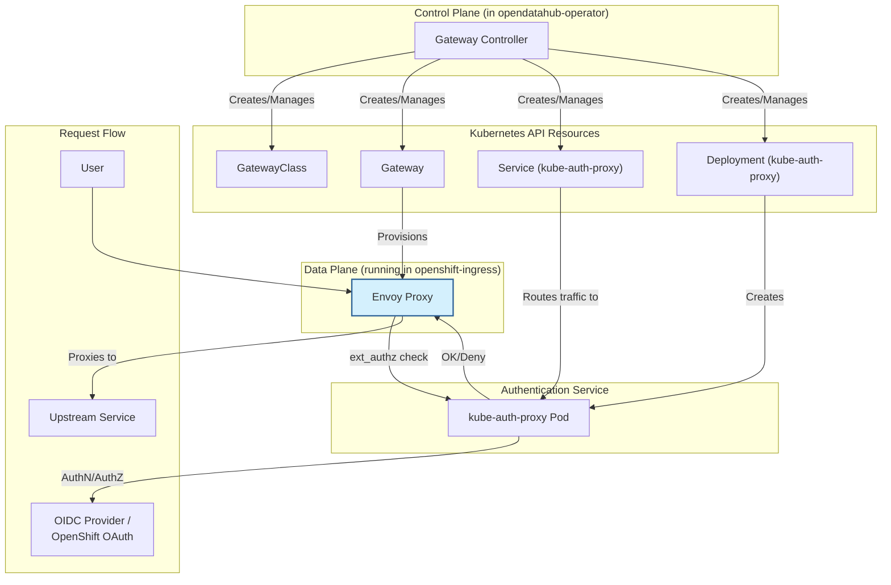
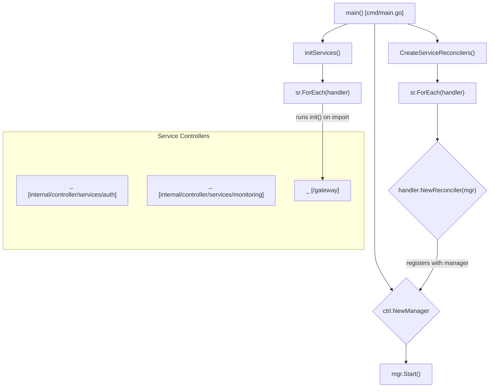

# ODH Gateway Controller Design Document

This document outlines the design for a new "gateway controller" for the `opendatahub-operator`. This controller will manage the ingress architecture for Open Data Hub (ODH), transitioning from the current model of multiple OpenShift Routes to a single, centralized Ingress Gateway using the Kubernetes Gateway API.

A primary motivation for this architectural change is to enable robust support for OpenShift Container Platform (OCP) clusters configured for "Bring Your Own OIDC" (BYOIDC). In these environments, the internal OpenShift OAuth server is disabled, and the Kubernetes API server is configured as an OIDC client for token validation against an external Identity Provider (IdP). The current `oauth-proxy` sidecar architecture is tightly coupled to the internal OAuth server, making it unsuitable for BYOIDC clusters.

The new gateway architecture will centralize authentication at the ingress layer, using `kube-auth-proxy` to handle authentication against either the internal OpenShift OAuth server or an external OIDC provider. This provides a unified and flexible solution for securing all ODH services, regardless of the cluster's authentication configuration, and streamlines the exposure of these services.

## 1. Requirements

### 1.1. Functional Requirements

| ID      | Description                                                                                                                                                             |
| :------ | :---------------------------------------------------------------------------------------------------------------------------------------------------------------------- |
| FR-001  | The controller MUST create and manage a `GatewayClass` resource named `odh-gateway-class` using the `openshift.io/gateway-controller/v1` controller.                      |
| FR-002  | The controller MUST create and manage a `Gateway` resource named `odh-gateway` in the `openshift-ingress` namespace.                                                    |
| FR-003  | The gateway MUST listen on port 443 and terminate TLS traffic.                                                                                                          |
| FR-004  | The gateway MUST support hostname routing for services within the ODH deployment.                                                                                       |
| FR-005  | The gateway controller MUST enforce authentication at the gateway level using envoy's `ext_authz` filter and `kube-auth-proxy`.                                           |
| FR-006  | The controller MUST support two authentication modes for `kube-auth-proxy`: OpenShift OAuth and OIDC.                                                                   |
| FR-007  | In OpenShift OAuth mode, the controller MUST automatically configure `kube-auth-proxy`'s client and client secret.                                                      |
| FR-008  | In OIDC mode, the controller MUST allow administrators to provide an issuer URL, client ID, and client secret via the `Auth` custom resource.                                            |
| FR-009  | The controller MUST be able to determine the cluster's authentication configuration (OpenShift OAuth vs. OIDC) or allow explicit configuration in the `DSCI` spec.      |
| FR-010  | The controller MUST support TLS certificate management using `cert-manager` for automatic certificate generation.                                                       |
| FR-011  | The controller MUST allow administrators to provide their own TLS certificate bundle via a Secret.                                                                      |
| FR-012  | All services currently exposed via OpenShift Routes (e.g., Prometheus, Alertmanager, KServe) MUST be migrated to use `HTTPRoutes` parented to the central `Gateway`.     |
| FR-013  | The `oauth-proxy` sidecar in existing component deployments MUST be replaced with a `kube-rbac-proxy` sidecar.                                                            |
| FR-014  | The controller MUST normalize the auth token header to `x-forwarded-token` for downstream services.                                                                     |
| FR-015  | The controller SHOULD provide an `x-forwarded-user` header.                                                                                                             |
| FR-016  | The `kube-auth-proxy` service MUST expose its `ext_authz` endpoint over a secure TLS connection.                                                                          |
| FR-017  | If the authentication mode is determined to be OIDC and the required configuration is not present in the `Auth` CR, the controller MUST NOT expose any services and MUST report a non-ready status condition (e.g., `Reason: AwaitingOIDCConfiguration`). |

### 1.2. Non-Functional Requirements

| ID       | Description                                                                                                                                      |
| :------- | :----------------------------------------------------------------------------------------------------------------------------------------------- |
| NFR-001  | The gateway controller and its components MUST be highly available.                                                                              |
| NFR-002  | The gateway architecture MUST be scalable to handle a large number of services and high traffic volumes.                                         |
| NFR-003  | The controller MUST be designed to be extensible for future enhancements.                                                                        |
| NFR-004  | The `kube-auth-proxy` image version MUST be configurable to allow pinning to a specific SHA digest for security.                                   |
| NFR-005  | The controller's actions MUST be idempotent.                                                                                                     |

## 2. Architecture

The following diagram illustrates the components of the gateway architecture and the request flow for an incoming user request.



The new gateway controller will be located in `internal/controller/services/gateway` within the `opendatahub-operator` repository, aligning with the existing project structure.

### 2.1. Components

1.  **Gateway CRD:** A new `Gateway` Custom Resource Definition will be introduced under the `services.platform.opendatahub.io` API group. This CRD will serve as the top-level configuration for the ODH gateway, specifying details such as the domain and certificate management strategy. The POC patch (`src/poc-patch.diff`) provides a strong starting point for this CRD.

2.  **Gateway Controller:** The core reconciler that watches the `Gateway` CR and manages the lifecycle of associated Kubernetes resources, including:
    *   `gateway.networking.k8s.io/v1.GatewayClass`
    *   `gateway.networking.k8s.io/v1.Gateway`
    *   `cert-manager.io/v1.Certificate` (if `cert-manager` is used)
    *   `core/v1.Secret` for TLS certificates.

3.  **Authentication Layer:**
    *   **`kube-auth-proxy`:** Deployed as a central service, it will handle the `ext_authz` check from the Envoy-based gateway.
    *   **TLS Security:** The `kube-auth-proxy` service will expose its `ext_authz` endpoint over TLS. This will be secured using OpenShift's serving certificate feature. The controller will add the `service.beta.openshift.io/serving-cert-secret-name` annotation to the `kube-auth-proxy` `Service`. The OpenShift service CA operator will then automatically generate a secret containing a signed TLS certificate and key, which will be mounted into the `kube-auth-proxy` pod.
    *   **Configuration:** The controller will manage the configuration of `kube-auth-proxy` based on the cluster's auth mode (OpenShift OAuth or OIDC).

4.  **Auth CRD:** The existing `Auth` CRD (`auths.services.platform.opendatahub.io`) will be extended to include configuration for OIDC providers. This will centralize authentication and authorization settings. The `AuthSpec` will be modified to include fields for `provider` (e.g. "OpenShift", "OIDC") and an `oidc` struct containing `issuerUrl`, `clientId`, and `clientSecretName`.

### 2.2. Authentication Flow

1.  A user attempts to access an ODH service endpoint.
2.  The request hits the central `Gateway`.
3.  The `Gateway`'s underlying Envoy proxy forwards the request to the `ext_authz` filter, which calls `kube-auth-proxy`.
4.  `kube-auth-proxy` performs authentication against either the OpenShift OAuth server or the configured external OIDC provider.
5.  If authentication is successful, `kube-auth-proxy` returns a `200 OK`. The request is then proxied to the upstream service. `kube-auth-proxy` will add the `x-forwarded-token` and `x-forwarded-user` headers.
6.  If authentication fails, `kube-auth-proxy` returns a `401 Unauthorized`, and the user is denied access.

### 2.3. Identifying Cluster Authentication Mode

Determining whether the cluster uses the internal OpenShift OAuth server or an external OIDC provider is a critical and currently unresolved issue.

> **Warning: Significant Information Gap**
> A **SPIKE** is required to determine the most reliable method for automatically detecting the cluster's authentication configuration. This is a significant gap in the current design. Potential investigation areas include inspecting the cluster `authentication.config.openshift.io` resource or programmatically checking the status of the internal OAuth server.
>
> **Fallback Plan:** As a fallback, an administrator can explicitly define the authentication provider in the `Auth` custom resource by setting the `spec.provider` field to `OpenShift` or `OIDC`. This ensures a functional path forward if the automatic detection proves too complex or unreliable.

### 2.4. Graceful Handling of Missing Configuration

To prevent a broken or insecure deployment, the controller will handle missing OIDC configuration gracefully. The logic is as follows:

1.  **Determine Auth Mode:** The controller will first determine the authentication mode by checking the `spec.provider` field in the `Auth` CR. If this field is not set, it will attempt to auto-detect the mode (as per the outcome of **SPIKE-001**).
2.  **Conditional Logic:**
    *   If the mode is `OpenShift`, the controller will proceed with gateway setup, ignoring any OIDC configuration.
    *   If the mode is `OIDC`, the controller will then check for the required OIDC details in the `Auth` CR.
        *   If the details are present and valid, it will proceed with gateway setup.
        *   If the details are missing, the controller will **halt the deployment of services through the gateway**. It will set the `Gateway` resource's status to `Ready: False` with a clear reason like `AwaitingOIDCConfiguration` and will requeue the request to re-check periodically. This ensures the system is "fail-secure" and provides clear feedback to the administrator.

## 3. Implementation Roadmap

This project will be implemented in phases to allow for iterative development and testing.

### Phase 1: Documentation and Core Controller Setup

- [ ] **Task 1.1:** Commit this design document to a suitable location (TBD) within the `opendatahub-operator` repository.
- [ ] **Task 1.2:** Create and merge the new `Gateway` CRD definition. The POC patch (`src/poc-patch.diff`) should be used as a reference for the API structure.
- [ ] **Task 1.3:** Implement the basic gateway controller in `internal/controller/services/gateway`. This controller will create the `GatewayClass` and `Gateway` resources.
- [ ] **Task 1.4:** Implement TLS certificate management, supporting both `cert-manager` and user-provided secrets. The logic from the POC patch can be used as a reference.

### Phase 2: Authentication Integration

- [ ] **Task 2.1:** Implement the logic to deploy and configure `kube-auth-proxy` as a central service. This includes creating its `Deployment` and `Service`, and configuring the `Service` with the necessary annotations (`service.beta.openshift.io/serving-cert-secret-name`) to enable automatic TLS serving certificates.
- [ ] **Task 2.2:** Add logic to the gateway controller to configure the `Gateway` with the `ext_authz` filter pointing to `kube-auth-proxy`.
- [ ] **Task 2.3:** Implement the OpenShift OAuth integration for `kube-auth-proxy`.
- [ ] **Task 2.4:** Extend the `Auth` CRD (`auth_types.go`) to include fields for OIDC configuration (issuer URL, client ID, client secret name).
- [ ] **Task 2.5:** Implement the OIDC integration, reading the configuration from the extended `Auth` CR. This includes the graceful handling logic to set a "waiting" status condition if the provider is OIDC but the configuration is incomplete.
- [ ] **Task 2.6:** Complete the research spike for detecting the cluster's auth mode and implement the detection logic or the explicit DSCI configuration.

### Phase 3: Component Migration

- [ ] **Task 3.1:** For each component currently using an OpenShift `Route` and `oauth-proxy` (e.g., KServe, Prometheus), create a separate PR to:
    *   Remove the `Route` creation logic.
    *   Create a `HTTPRoute` that attaches to the central `odh-gateway`.
    *   Replace the `oauth-proxy` sidecar with a `kube-rbac-proxy` sidecar for service-level authorization.
- [ ] **Task 3.2:** Update any relevant webhooks that might be affected by the move from `Route` objects to `HTTPRoute` objects.

## 4. Test Plan

### 4.1. Unit Tests

*   Each controller action (e.g., `createCertificateResources`, `initialize`) will have corresponding unit tests.
*   The logic for determining auth mode will be unit tested.
*   Reconciliation logic will be tested using a fake client.

### 4.2. E2E Tests

*   **Scenario 1: OpenShift OAuth Mode**
    *   Deploy the operator on a standard OpenShift cluster.
    *   Verify the `Gateway` is created and configured correctly.
    *   Verify that accessing a protected service redirects to the OpenShift login page.
    *   Verify successful login grants access.
*   **Scenario 2: OIDC Mode**
    *   Configure the cluster with an external OIDC provider.
    *   Provide the OIDC client secret to the operator.
    *   Verify the `Gateway` is configured for OIDC.
    *   Verify that accessing a protected service redirects to the external IDP.
*   **Scenario 3: Certificate Management**
    *   Test the `cert-manager` integration by deploying it and verifying a certificate is issued.
    *   Test the user-provided certificate functionality by creating a secret and verifying the gateway uses it.
*   **Scenario 4: Component Migration**
    *   For each migrated component, verify that its `HTTPRoute` is created and that it is accessible through the gateway.

## 5. Open Questions & Research Spikes

> **Action Required: Open Questions & Spikes**
> The following items require further investigation and decisions before implementation can be considered complete.
>
> *   **SPIKE-001:** Determine the best method to automatically detect the cluster's authentication configuration (OpenShift OAuth vs. OIDC). This is the most critical unknown.
> *   **Question-001:** What is the best practice for coordinating the `kube-auth-proxy` image version with the devops team to allow for pinning? This involves defining a process for version management and security scanning.
> *   **Question-002:** Does `kube-auth-proxy` provide the necessary information to create an `x-forwarded-user` header? This needs to be confirmed by inspecting the proxy's behavior and documentation.

---
*This document is based on the initial pre-design, analysis of the `opendatahub-operator` source code, the POC patch provided in `src/poc-patch.diff`, and the official OpenShift Gateway API documentation.*

---

## Appendix

### Example `Auth` CR with OIDC Configuration

Below is an example of what the `Auth` custom resource would look like when configured for an external OIDC provider.

```yaml
apiVersion: services.platform.opendatahub.io/v1alpha1
kind: Auth
metadata:
  name: auth
spec:
  provider: OIDC
  adminGroups:
    - "odh-admins"
  allowedGroups:
    - "system:authenticated"
  oidc:
    issuerUrl: "https://my-oidc-provider.com/auth/realms/my-realm"
    clientId: "opendatahub"
    clientSecretName: "oidc-client-secret"
```

### Operator Initialization Flow

The following diagram illustrates how the operator's main entrypoint initializes and registers the service controllers, including the proposed gateway controller.

1.  The `main()` function in `cmd/main.go` starts the process and creates a new controller manager.
2.  During initialization (`initServices`), the operator iterates through all service controller packages that have been imported. The Go `init()` function in each package registers a handler with the service registry.
3.  Later, `CreateServiceReconcilers` iterates through the registered handlers and calls `NewReconciler()` for each, which sets up the specific controller's reconciler with the manager.
4.  Finally, the manager is started, and all registered controllers begin their reconciliation loops.

