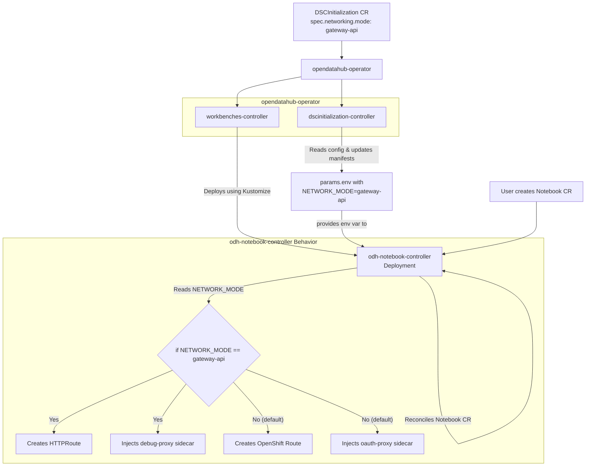

"# Jupyter Notebook Architecture

This document outlines the architecture of the Jupyter notebook deployment within the OpenDataHub ecosystem.

## Overview

Jupyter notebooks are managed by a combination of the `opendatahub-operator` and a specialized `odh-notebook-controller`. The `opendatahub-operator` is responsible for the overall lifecycle of the OpenDataHub components, including the deployment of the notebook controller. The `odh-notebook-controller` is a customized version of the upstream Kubeflow notebook controller that includes features specific to OpenDataHub, such as OAuth integration and custom certificate management.

## Components

### opendatahub-operator

The `opendatahub-operator` is the top-level operator that manages the deployment of all OpenDataHub components. The `workbenches` component within the operator is specifically responsible for deploying and managing Jupyter notebooks.

The `workbenches` controller uses Kustomize to build and deploy the manifests for the `odh-notebook-controller`. It also manages the creation of the namespace where the notebooks will be launched.

### odh-notebook-controller

The `odh-notebook-controller` is a customized version of the Kubeflow notebook controller. It's responsible for the following:

*   **Notebook Lifecycle**: The controller manages the creation, updating, and deletion of Jupyter notebook pods.
*   **Authentication**: The controller can inject an `oauth-proxy` sidecar container into the notebook pod to handle authentication.
*   **Networking**: The controller creates a `Service` and a `Route` (or an `HTTPRoute` in `gateway-api` mode) to expose the notebook to the network.
*   **Customization**: The controller is configured through a set of manifests that can be customized to change its behavior.

## End-to-End Configuration Flow

The networking configuration for Jupyter notebooks is managed through the `DataScienceClusterInitialization` (DSCI) custom resource. The `networking.mode` field in the DSCI spec determines how the notebooks are exposed to the network.

Here's the end-to-end flow:

1.  **DSCI Configuration**: An administrator sets the `networking.mode` field in the `DSCInitialization` resource to either `"default"` or `"gateway-api"`.

2.  **`dscinitialization` Controller**: The `dscinitialization` controller in the `opendatahub-operator` reconciles the `DSCInitialization` resource. It reads the value of the `networking.mode` field and stores it in a variable.

3.  **Parameter Application**: The `dscinitialization` controller then calls the `deploy.ApplyParams` function, which updates the `params.env` file in the `odh-notebook-controller`'s manifests (`/home/jtanner/workspace/github/jctanner.redhat/odh-security-2.0.test/src/opendatahub-operator/opt/manifests/workbenches/odh-notebook-controller/base/params.env`). It sets the `NETWORK_MODE` environment variable in this file to the value from the `DSCInitialization` spec.

4.  **`workbenches` Controller**: The `workbenches` controller in the `opendatahub-operator` uses Kustomize to build and deploy the `odh-notebook-controller`. As part of this process, it creates a `ConfigMap` from the `params.env` file.

5.  **`odh-notebook-controller` Deployment**: The `odh-notebook-controller`'s deployment is patched to mount the `ConfigMap` as an environment variable source. This makes the `NETWORK_MODE` environment variable available to the notebook controller.

6.  **`odh-notebook-controller` Logic**: The `odh-notebook-controller` reads the `NETWORK_MODE` environment variable at runtime and adjusts its behavior accordingly, as described in the "Networking Modes" section below.

## Networking Modes

The `odh-notebook-controller` supports two networking modes, which are controlled by the `NETWORK_MODE` environment variable:

### Standard Mode

In the standard mode, the controller creates a `Route` to expose the notebook. If OAuth is enabled, it also injects an `oauth-proxy` sidecar to handle authentication.

### gateway-api Mode

When the `NETWORK_MODE` is set to `gateway-api`, the controller's behavior is modified as follows:

*   **HTTPRoute**: Instead of a `Route`, the controller creates an `HTTPRoute` resource to expose the notebook through the OpenShift Gateway API.
*   **Debug Proxy**: The `oauth-proxy` sidecar is replaced with a `debug-proxy` container. This is useful for debugging and development, as it allows direct access to the notebook without authentication.
*   **Service Account**: The service account for the notebook is modified to remove the OAuth redirect annotation, as it's not needed for the `debug-proxy`.

## Manifests

The `odh-notebook-controller` is configured through a set of Kustomize manifests located in `/home/jtanner/workspace/github/jctanner.redhat/odh-security-2.0.test/src/opendatahub-operator/opt/manifests/workbenches/odh-notebook-controller`. These manifests define the resources that are deployed by the controller, including the controller's deployment, RBAC rules, and webhook configurations.

The `params.env` file in the `base` directory is used to set the image for the `odh-notebook-controller` container. This can be customized to use a different image for development or testing.

## Architecture Diagram

